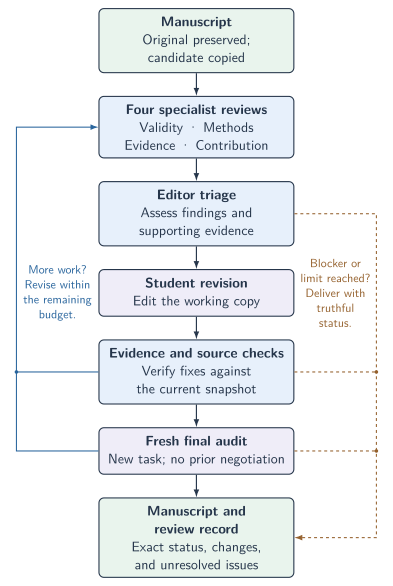

# Adversarial Manuscript Review

One invocation in **Codex** or **Claude Code** starts four specialist AI reviewers, a student agent that revises a working copy, evidence checks, and a fresh final audit. You receive the revised source and a complete review record. The original is preserved by default.

> **A research aid, never a substitute for real peer review or a researcher's work.** AI reviewers can be wrong. Treat comments and proposed corrections as feedback to investigate, not authoritative conclusions. Apply academic, scientific, and, where relevant, clinical judgment to every suggestion. Responsibility remains with the researcher.

> **Back up the entire manuscript folder first:** main LaTeX file, included sources, tables, figures, bibliography, data, and other dependencies. Keep that backup untouched. Omit `--in-place` to use the default working copy, and inspect all changes before accepting them.

## Get started

Requires Python 3.10+, a POSIX shell on macOS or Linux, and native child-agent support in your client. Native Windows is unsupported; completed Linux validation is not claimed. The helper uses only the Python standard library.

Clone into a stable location, replacing `OWNER` with the repository owner:

```sh
git clone https://github.com/OWNER/adversarial-manuscript-review.git "$HOME/.local/share/adversarial-manuscript-review"
cd "$HOME/.local/share/adversarial-manuscript-review"
python3 install.py install --host all
python3 install.py diagnose --host all
```

Use `--host codex` or `--host claude` to install only one client. Start a **new conversation**, then enter the matching invocation in its composer:

| Client | Invocation |
|---|---|
| Codex | `$adversarial-manuscript-review /path/to/manuscript.tex` |
| Claude Code | `/adversarial-manuscript-review /path/to/manuscript.tex` |

Replace the example with the manuscript's absolute path. This is composer input, not a shell command. Keep the installed clone in place and finish active runs before updating it. See [installation and removal](docs/installation.md) or try the [synthetic quickstart](docs/quickstart.md).

## How it works

<p align="center">
  <picture>
    <source media="(prefers-color-scheme: dark)" srcset="docs/figures/review-workflow-dark.svg" />
    <source media="(prefers-color-scheme: light)" srcset="docs/figures/review-workflow.svg" />
    
  </picture>
</p>

The host acts as editor. Four separate native agents examine validity, methods, evidence, and contribution. The student makes supported source changes. Every finding, including minor comments and fresh-audit findings, needs a verified fix or an evidence-based rebuttal. The loop continues within frozen limits; missing evidence, permissions, or capabilities remain explicit blockers.

Default limits: four rounds, 32 child dispatches, two fresh audits, and 90 minutes checked at stage boundaries. Active model calls can exceed the wall limit. The helper records evidence and enforces structural gates; it cannot establish scientific truth or guarantee acceptance. [Workflow, budgets, and statuses](docs/workflow.md).

## Inputs and results

Markdown and a bounded TeX dependency subset support revision. PDF-only input needs verified corresponding editable source for faithful revision; DOCX revision is unsupported. [Format limits](docs/formats.md).

Optional controls: `--review-only` for reports without edits, `--resume` for an incomplete run, and `--max-rounds N`. Advanced `--in-place` promotion requires internal acceptance, conflict checks, and backups; it cannot be combined with review-only mode. The default working copy is recommended.

Results appear beside the source in `<stem>.review/<run-id>/deliverables/`: the revised project, review result, responses, changes, unresolved issues, and recorded checks. Keep the entire run directory for evidence and recovery. `PASS_INTERNAL` means the configured internal gates passed, not journal acceptance or proof of correctness.

Native inference may send manuscript content to the host's configured provider. Local records do not imply offline inference. Read [security and privacy](SECURITY.md) before supplying confidential work.

## Further guidance

- [Token usage study and reproducible plots](docs/token-usage.md)
- [Troubleshooting and recovery](docs/troubleshooting.md)
- [Contributing and verification](CONTRIBUTING.md) · [Changelog](CHANGELOG.md)
- Agent protocol: [workflow](skill/references/workflow.md), [record interface](skill/references/records.md), and [host adapters](skill/references/hosts.md)

Licensed under [MIT](LICENSE).
