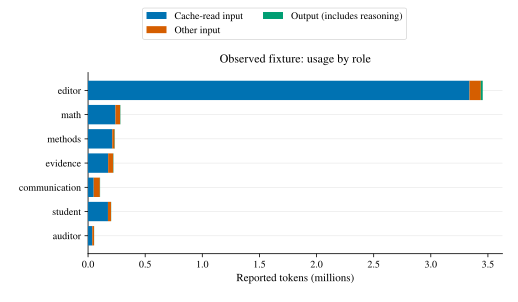
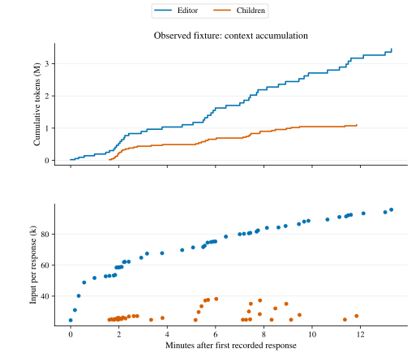
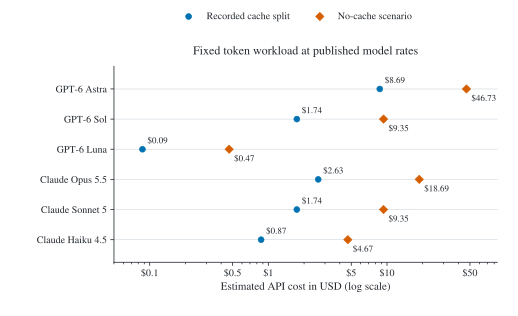
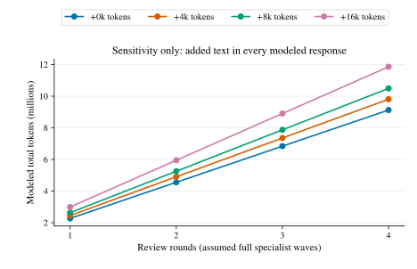
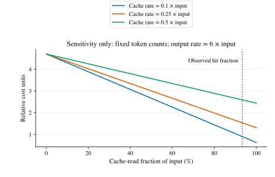

# Token usage and model cost

**One synthetic revision used 4.56 million tokens across 87 responses. The main/editor
accounted for 75.8%; 93.4% of input was cached.** This measures one short fixture,
not a typical paper. The main agent also acts as editor; six child roles perform
specialist review, revision, and final audit.

## Measured usage

The 2026-09-21 run used Codex 0.155.1 / GPT-6 Astra on the shipped
[92-word fixture](../fixtures/manuscript.md): two rounds, ten child sessions, and
one audit. It reached `PASS_INTERNAL`; all twelve saved-artifact checks passed.

| Role | Responses | Total tokens |
|---|---:|---:|
| Main/editor | 48 | 3,454,582 |
| Mathematics | 10 | 283,445 |
| Methods | 9 | 234,569 |
| Evidence | 8 | 222,520 |
| Communication | 4 | 105,233 |
| Student | 6 | 202,385 |
| Fresh auditor | 2 | 53,074 |
| **Total** | **87** | **4,555,808** |

<picture>
  <source media="(prefers-color-scheme: dark)" srcset="figures/token-usage/roles-dark.svg" />
  <source media="(prefers-color-scheme: light)" srcset="figures/token-usage/roles.svg" />
  
</picture>

Input totals **4,526,403**: 4,227,072 cache reads, 299,331 uncached tokens, and zero
reported cache writes. Output totals **29,405**, including 1,079 reasoning tokens.
Cache reads remain input; reasoning is already included in output.

<picture>
  <source media="(prefers-color-scheme: dark)" srcset="figures/token-usage/timeline-dark.svg" />
  <source media="(prefers-color-scheme: light)" srcset="figures/token-usage/timeline.svg" />
  
</picture>

The editor's input grew from 24,409 to 95,899 tokens per response. Repeated context
is therefore the main place to investigate savings: return compact tool summaries
and reference evidence files instead of repeatedly copying reports. Keep specialist
independence, verified issue closure, and the fresh audit intact. These suggestions
are hypotheses; no savings intervention was tested.

## Dollar comparison

**Published API rates applied to the measured token workload—not actual invoices.**
All models use the same token counts. The two scenarios retain the recorded cache
split or charge all input at the uncached rate. Actual model runs can differ in
tokenization, cache eligibility, reasoning, response count, and review quality.
Subscription fees and credits cannot be inferred from this comparison.

<picture>
  <source media="(prefers-color-scheme: dark)" srcset="figures/token-usage/model-costs-dark.svg" />
  <source media="(prefers-color-scheme: light)" srcset="figures/token-usage/model-costs.svg" />
  
</picture>

Standard API prices, verified **2026-09-23**, in USD per million tokens:

| Model | Input | Cache read | Cache write¹ | Output |
|---|---:|---:|---:|---:|
| GPT-6 Astra | $10 | $1 | $12.50 | $50 |
| GPT-6 Sol | $2 | $0.20 | $2.50 | $10 |
| GPT-6 Luna | $0.10 | $0.01 | $0.125 | $0.50 |
| Claude Opus 5.5 | $4 | $0.20 | $5 | $20 |
| Claude Sonnet 5 | $2 | $0.20 | $2.50 | $10 |
| Claude Haiku 4.5 | $1 | $0.10 | $1.25 | $5 |

Sources: [OpenAI pricing](https://developers.openai.com/api/docs/pricing) and
[Claude pricing](https://platform.claude.com/docs/en/about-claude/pricing).
¹ Claude writes use the five-minute rate. No writes were reported in this workload;
a different caching setup can incur them. Every recorded request is below 96k input
tokens, within the priced ranges. Excludes fast/batch pricing, regional premiums,
tools, taxes, and subscriptions. [Rate snapshot and assumptions](data/token-usage/pricing.json).

Cost is the sum of uncached input, cache reads, cache writes, and output, each
multiplied by its rate and divided by one million. At these rates, the observed
Astra workload is **$8.69**, versus **$46.73** with no cache reuse. These are API-rate
estimates, not the user's subscription charge.

## Sensitivity, not a forecast

<picture>
  <source media="(prefers-color-scheme: dark)" srcset="figures/token-usage/sensitivity-dark.svg" />
  <source media="(prefers-color-scheme: light)" srcset="figures/token-usage/sensitivity.svg" />
  
</picture>

The model retains measured specialist/student/audit usage, scales editor usage
linearly with rounds, and adds manuscript tokens to every response shown. It
assumes four specialists per round, one student per later round, and one audit;
one round includes no revision. Two rounds plus 8,000 tokens per response gives
**5.25 million tokens**. Extra checks, retries, and harder papers can exceed this.
The JSON also includes 25% and 50% text-exposure scenarios. Dispatch limits are
not token caps.

<picture>
  <source media="(prefers-color-scheme: dark)" srcset="figures/token-usage/cache-dark.svg" />
  <source media="(prefers-color-scheme: light)" srcset="figures/token-usage/cache.svg" />
  
</picture>

This separate cache sensitivity uses hypothetical relative rates, fixed token
counts, and zero writes. It illustrates why token volume alone does not determine
cost; the dollar plot above uses actual published rates.

## Evidence and reproduction

[Response data](data/token-usage/observed.json) · [Totals, scenarios, and dollar estimates](data/token-usage/summary.json)
· [Provenance](data/token-usage/provenance.json) · [Artifact checks](data/token-usage/fixture-check.json)

The [exporter](../scripts/token_usage.py) deduplicates response IDs and reconciles
per-response sums with each session's final counter. All eleven sessions reconcile;
the ten child contexts match the helper's completed tasks. Cumulative counters are
not added again. Raw transcripts remain private; source hashes allow local identity
checks. The exporter requires complete, dedicated sessions and an explicit private
manifest of `path`, `role`, and `phase` for the editor and every child.

```sh
python scripts/token_usage.py /path/to/private-manifest.json /path/to/usage.json
python scripts/plot_token_usage.py
python -m pytest -q tests/test_token_usage.py tests/test_token_plots.py
```

Plot dependencies are in `requirements-analysis.txt`. The script exports transparent
light/dark SVG, EPS, PDF, and PNG; Git tracks the vectors (SVG/EPS). GitHub selects
the matching SVG through `picture` elements. Review logic and budgets are unchanged.

**Limits:** one synthetic Codex run, no repeated trials or measured Claude runs.
Setup sessions, this study's production cost, and unlogged tool usage are excluded.
Typical-paper cost and equivalent review quality need separate measurements.
